# 安全連線
### Windows:Putty
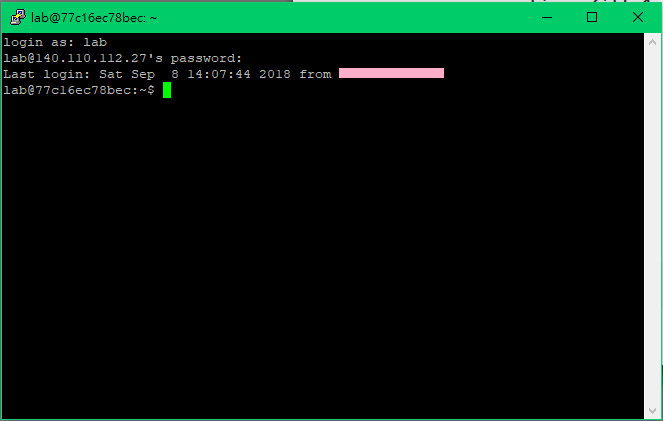
### Linux:ssh

# 第一題解答
```
ssh連線進入140.110.112.27:2200
使用lab登入
指令:ls,cat
找到檔案flag
cat flag擷取內容
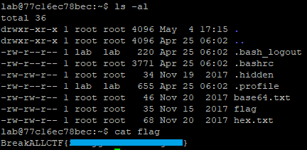
```
# 第二題解答
```
ssh連線進入140.110.112.27:2200
使用lab登入
指令:ls -al,cat
找到隱藏檔案 .hidden
cat .hidden擷取內容
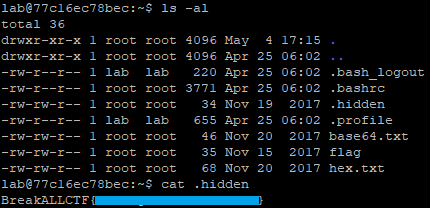
```
# 第三題解答
```
ssh連線進入140.110.112.27:2200
使用lab登入
指令:ls,cat
找到檔案hex.txt
cat hex.txt擷取內容
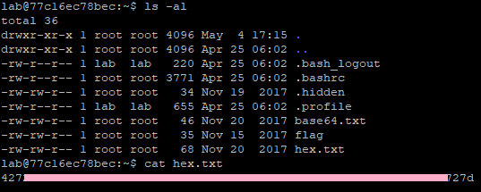
使用網路工具hex -> string
```
# 第四題解答
```
ssh連線進入140.110.112.27:2200
使用lab登入
指令:ls,cat
找到檔案base64.txt
cat base64.txt擷取內容
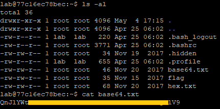
使用網路工具base64 decoder解碼
```
# 第五題解答
```
ssh連線進入140.110.112.27:2200
使用lab登入
指令:find,cat
find -name secret
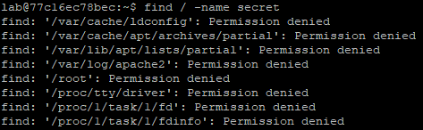
找到唯一可存取的檔案
使用cat擷取
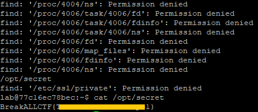
```
# 第六題解答
```
ssh連線進入140.110.112.27:2200
使用lab登入
指令:curl
curl 127.0.0.1:2111
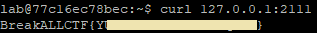
```
# 第七題解答
```
ssh連線進入140.110.112.27:2200
使用lab登入
指令:curl
curl 127.0.0.1:80
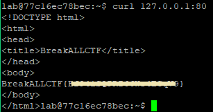
```
# 第八題解答
```
ssh連線進入140.110.112.27:2200
使用lab登入
指令:cd,mkdir,wget,tar,cat
cd /tmp
mkdir zz
cd zz
wget wget http://120.114.62.39/ForYou.tar.gz
tar -xf ForYou.tar.gz
cat ForYou
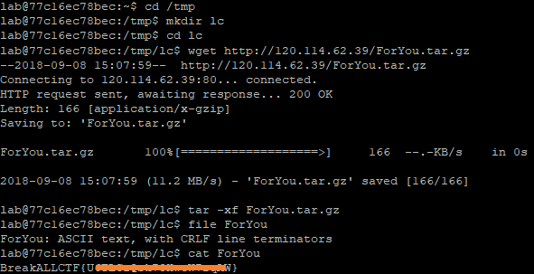
```
# 第九題解答
```
ssh連線進入140.110.112.27:2200
使用lab登入
指令:cd,mkdir,wget,chmod,cat
cd /tmp
mkdir zz
cd zz
wget http://120.114.62.39/TobeExe
chmod +x TobeExe
./TobeExe
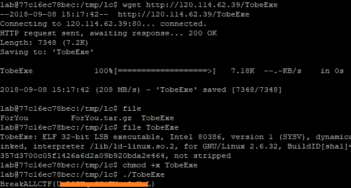
```
# 第十題解答
```
ssh連線進入140.110.112.27:2200
使用lab登入
指令:cd,mkdir,wget,tar,cat
cd /tmp
mkdir zz
cd zz
wget http://120.114.62.39/reverse
strings reverse
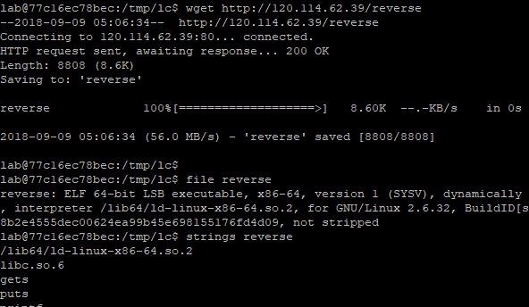
```

# 指令
xxd -h
```
Usage:
       xxd [options] [infile [outfile]]
    or
       xxd -r [-s [-]offset] [-c cols] [-ps] [infile [outfile]]
Options:
    -a          toggle autoskip: A single '*' replaces nul-lines. Default off.
    -b          binary digit dump (incompatible with -ps,-i,-r). Default hex.
    -c cols     format <cols> octets per line. Default 16 (-i: 12, -ps: 30).
    -E          show characters in EBCDIC. Default ASCII.
    -e          little-endian dump (incompatible with -ps,-i,-r).
    -g          number of octets per group in normal output. Default 2 (-e: 4).
    -h          print this summary.
    -i          output in C include file style.
    -l len      stop after <len> octets.
    -o off      add <off> to the displayed file position.
    -ps         output in postscript plain hexdump style.
    -r          reverse operation: convert (or patch) hexdump into binary.
    -r -s off   revert with <off> added to file positions found in hexdump.
    -s [+][-]seek  start at <seek> bytes abs. (or +: rel.) infile offset.
    -u          use upper case hex letters.
    -v          show version: "xxd V1.10 27oct98 by Juergen Weigert".
```

ls --help
```
Usage: ls [OPTION]... [FILE]...
List information about the FILEs (the current directory by default).
Sort entries alphabetically if none of -cftuvSUX nor --sort is specified.

Mandatory arguments to long options are mandatory for short options too.
 -a, --all                  do not ignore entries starting with .
 -A, --almost-all           do not list implied . and ..
     --author               with -l, print the author of each file
 -b, --escape               print C-style escapes for nongraphic characters
     --block-size=SIZE      scale sizes by SIZE before printing them; e.g.,
                              '--block-size=M' prints sizes in units of
                              1,048,576 bytes; see SIZE format below
 -B, --ignore-backups       do not list implied entries ending with ~
 -c                         with -lt: sort by, and show, ctime (time of last
                              modification of file status information);
                              with -l: show ctime and sort by name;
                              otherwise: sort by ctime, newest first
 -C                         list entries by columns
     --color[=WHEN]         colorize the output; WHEN can be 'always' (default
                              if omitted), 'auto', or 'never'; more info below
 -d, --directory            list directories themselves, not their contents
 -D, --dired                generate output designed for Emacs' dired mode
 -f                         do not sort, enable -aU, disable -ls --color
 -F, --classify             append indicator (one of */=>@|) to entries
     --file-type            likewise, except do not append '*'
     --format=WORD          across -x, commas -m, horizontal -x, long -l,
                              single-column -1, verbose -l, vertical -C
     --full-time            like -l --time-style=full-iso
 -g                         like -l, but do not list owner
     --group-directories-first
                            group directories before files;
                              can be augmented with a --sort option, but any
                              use of --sort=none (-U) disables grouping
 -G, --no-group             in a long listing, don't print group names
 -h, --human-readable       with -l and/or -s, print human readable sizes
                              (e.g., 1K 234M 2G)
     --si                   likewise, but use powers of 1000 not 1024
 -H, --dereference-command-line
                            follow symbolic links listed on the command line
     --dereference-command-line-symlink-to-dir
                            follow each command line symbolic link
                              that points to a directory
     --hide=PATTERN         do not list implied entries matching shell PATTERN
                              (overridden by -a or -A)
     --indicator-style=WORD  append indicator with style WORD to entry names:
                              none (default), slash (-p),
                              file-type (--file-type), classify (-F)
 -i, --inode                print the index number of each file
 -I, --ignore=PATTERN       do not list implied entries matching shell PATTERN
 -k, --kibibytes            default to 1024-byte blocks for disk usage
 -l                         use a long listing format
 -L, --dereference          when showing file information for a symbolic
                              link, show information for the file the link
                              references rather than for the link itself
 -m                         fill width with a comma separated list of entries
 -n, --numeric-uid-gid      like -l, but list numeric user and group IDs
 -N, --literal              print raw entry names (don't treat e.g. control
                              characters specially)
 -o                         like -l, but do not list group information
 -p, --indicator-style=slash
                            append / indicator to directories
 -q, --hide-control-chars   print ? instead of nongraphic characters
     --show-control-chars   show nongraphic characters as-is (the default,
                              unless program is 'ls' and output is a terminal)
 -Q, --quote-name           enclose entry names in double quotes
     --quoting-style=WORD   use quoting style WORD for entry names:
                              literal, locale, shell, shell-always,
                              shell-escape, shell-escape-always, c, escape
 -r, --reverse              reverse order while sorting
 -R, --recursive            list subdirectories recursively
 -s, --size                 print the allocated size of each file, in blocks
 -S                         sort by file size, largest first
     --sort=WORD            sort by WORD instead of name: none (-U), size (-S),
                              time (-t), version (-v), extension (-X)
     --time=WORD            with -l, show time as WORD instead of default
                              modification time: atime or access or use (-u);
                              ctime or status (-c); also use specified time
                              as sort key if --sort=time (newest first)
     --time-style=STYLE     with -l, show times using style STYLE:
                              full-iso, long-iso, iso, locale, or +FORMAT;
                              FORMAT is interpreted like in 'date'; if FORMAT
                              is FORMAT1<newline>FORMAT2, then FORMAT1 applies
                              to non-recent files and FORMAT2 to recent files;
                              if STYLE is prefixed with 'posix-', STYLE
                              takes effect only outside the POSIX locale
 -t                         sort by modification time, newest first
 -T, --tabsize=COLS         assume tab stops at each COLS instead of 8
 -u                         with -lt: sort by, and show, access time;
                              with -l: show access time and sort by name;
                              otherwise: sort by access time, newest first
 -U                         do not sort; list entries in directory order
 -v                         natural sort of (version) numbers within text
 -w, --width=COLS           set output width to COLS.  0 means no limit
 -x                         list entries by lines instead of by columns
 -X                         sort alphabetically by entry extension
 -Z, --context              print any security context of each file
 -1                         list one file per line.  Avoid '\n' with -q or -b
     --help     display this help and exit
     --version  output version information and exit

The SIZE argument is an integer and optional unit (example: 10K is 10*1024).
Units are K,M,G,T,P,E,Z,Y (powers of 1024) or KB,MB,... (powers of 1000).

Using color to distinguish file types is disabled both by default and
with --color=never.  With --color=auto, ls emits color codes only when
standard output is connected to a terminal.  The LS_COLORS environment
variable can change the settings.  Use the dircolors command to set it.

Exit status:
0  if OK,
1  if minor problems (e.g., cannot access subdirectory),
2  if serious trouble (e.g., cannot access command-line argument).

GNU coreutils online help: <http://www.gnu.org/software/coreutils/>
Report ls translation bugs to <http://translationproject.org/team/>
Full documentation at: <http://www.gnu.org/software/coreutils/ls>
or available locally via: info '(coreutils) ls invocation'
```

tar --help
```
Usage: tar [OPTION...] [FILE]...
GNU 'tar' saves many files together into a single tape or disk archive, and can
restore individual files from the archive.

Examples:
 tar -cf archive.tar foo bar  # Create archive.tar from files foo and bar.
 tar -tvf archive.tar         # List all files in archive.tar verbosely.
 tar -xf archive.tar          # Extract all files from archive.tar.

Main operation mode:

 -A, --catenate, --concatenate   append tar files to an archive
 -c, --create               create a new archive
 -d, --diff, --compare      find differences between archive and file system
     --delete               delete from the archive (not on mag tapes!)
 -r, --append               append files to the end of an archive
 -t, --list                 list the contents of an archive
     --test-label           test the archive volume label and exit
 -u, --update               only append files newer than copy in archive
 -x, --extract, --get       extract files from an archive

Operation modifiers:

     --check-device         check device numbers when creating incremental
                            archives (default)
 -g, --listed-incremental=FILE   handle new GNU-format incremental backup
 -G, --incremental          handle old GNU-format incremental backup
     --ignore-failed-read   do not exit with nonzero on unreadable files
     --level=NUMBER         dump level for created listed-incremental archive
 -n, --seek                 archive is seekable
     --no-check-device      do not check device numbers when creating
                            incremental archives
     --no-seek              archive is not seekable
     --occurrence[=NUMBER]  process only the NUMBERth occurrence of each file
                            in the archive; this option is valid only in
                            conjunction with one of the subcommands --delete,
                            --diff, --extract or --list and when a list of
                            files is given either on the command line or via
                            the -T option; NUMBER defaults to 1
     --sparse-version=MAJOR[.MINOR]
                            set version of the sparse format to use (implies
                            --sparse)
 -S, --sparse               handle sparse files efficiently

Overwrite control:

 -k, --keep-old-files       don't replace existing files when extracting,
                            treat them as errors
     --keep-directory-symlink   preserve existing symlinks to directories when
                            extracting
     --keep-newer-files     don't replace existing files that are newer than
                            their archive copies
     --no-overwrite-dir     preserve metadata of existing directories
     --one-top-level[=DIR]  create a subdirectory to avoid having loose files
                            extracted
     --overwrite            overwrite existing files when extracting
     --overwrite-dir        overwrite metadata of existing directories when
                            extracting (default)
     --recursive-unlink     empty hierarchies prior to extracting directory
     --remove-files         remove files after adding them to the archive
     --skip-old-files       don't replace existing files when extracting,
                            silently skip over them
 -U, --unlink-first         remove each file prior to extracting over it
 -W, --verify               attempt to verify the archive after writing it

Select output stream:

     --ignore-command-error ignore exit codes of children
     --no-ignore-command-error   treat non-zero exit codes of children as
                            error
 -O, --to-stdout            extract files to standard output
     --to-command=COMMAND   pipe extracted files to another program

Handling of file attributes:

     --atime-preserve[=METHOD]   preserve access times on dumped files, either
                            by restoring the times after reading
                            (METHOD='replace'; default) or by not setting the
                            times in the first place (METHOD='system')
     --clamp-mtime          only set time when the file is more recent than
                            what was given with --mtime
     --delay-directory-restore   delay setting modification times and
                            permissions of extracted directories until the end
                            of extraction
     --group=NAME           force NAME as group for added files
     --mode=CHANGES         force (symbolic) mode CHANGES for added files
     --mtime=DATE-OR-FILE   set mtime for added files from DATE-OR-FILE
 -m, --touch                don't extract file modified time
     --no-delay-directory-restore
                            cancel the effect of --delay-directory-restore
                            option
     --no-same-owner        extract files as yourself (default for ordinary
                            users)
     --no-same-permissions  apply the user's umask when extracting permissions
                            from the archive (default for ordinary users)
     --numeric-owner        always use numbers for user/group names
     --owner=NAME           force NAME as owner for added files
 -p, --preserve-permissions, --same-permissions
                            extract information about file permissions
                            (default for superuser)
     --preserve             same as both -p and -s
     --same-owner           try extracting files with the same ownership as
                            exists in the archive (default for superuser)
 -s, --preserve-order, --same-order
                            member arguments are listed in the same order as
                            the files in the archive
     --sort=ORDER           directory sorting order: none (default), name or
                            inode

Handling of extended file attributes:

     --acls                 Enable the POSIX ACLs support
     --no-acls              Disable the POSIX ACLs support
     --no-selinux           Disable the SELinux context support
     --no-xattrs            Disable extended attributes support
     --selinux              Enable the SELinux context support
     --xattrs               Enable extended attributes support
     --xattrs-exclude=MASK  specify the exclude pattern for xattr keys
     --xattrs-include=MASK  specify the include pattern for xattr keys

Device selection and switching:

 -f, --file=ARCHIVE         use archive file or device ARCHIVE
     --force-local          archive file is local even if it has a colon
 -F, --info-script=NAME, --new-volume-script=NAME
                            run script at end of each tape (implies -M)
 -L, --tape-length=NUMBER   change tape after writing NUMBER x 1024 bytes
 -M, --multi-volume         create/list/extract multi-volume archive
     --rmt-command=COMMAND  use given rmt COMMAND instead of rmt
     --rsh-command=COMMAND  use remote COMMAND instead of rsh
     --volno-file=FILE      use/update the volume number in FILE

Device blocking:

 -b, --blocking-factor=BLOCKS   BLOCKS x 512 bytes per record
 -B, --read-full-records    reblock as we read (for 4.2BSD pipes)
 -i, --ignore-zeros         ignore zeroed blocks in archive (means EOF)
     --record-size=NUMBER   NUMBER of bytes per record, multiple of 512

Archive format selection:

 -H, --format=FORMAT        create archive of the given format

FORMAT is one of the following:

   gnu                      GNU tar 1.13.x format
   oldgnu                   GNU format as per tar <= 1.12
   pax                      POSIX 1003.1-2001 (pax) format
   posix                    same as pax
   ustar                    POSIX 1003.1-1988 (ustar) format
   v7                       old V7 tar format

     --old-archive, --portability
                            same as --format=v7
     --pax-option=keyword[[:]=value][,keyword[[:]=value]]...
                            control pax keywords
     --posix                same as --format=posix
 -V, --label=TEXT           create archive with volume name TEXT; at
                            list/extract time, use TEXT as a globbing pattern
                            for volume name

Compression options:

 -a, --auto-compress        use archive suffix to determine the compression
                            program
 -I, --use-compress-program=PROG
                            filter through PROG (must accept -d)
 -j, --bzip2                filter the archive through bzip2
 -J, --xz                   filter the archive through xz
     --lzip                 filter the archive through lzip
     --lzma                 filter the archive through xz
     --lzop                 filter the archive through xz
     --no-auto-compress     do not use archive suffix to determine the
                            compression program
 -z, --gzip, --gunzip, --ungzip   filter the archive through gzip
 -Z, --compress, --uncompress   filter the archive through compress

Local file selection:

     --add-file=FILE        add given FILE to the archive (useful if its name
                            starts with a dash)
     --backup[=CONTROL]     backup before removal, choose version CONTROL
 -C, --directory=DIR        change to directory DIR
     --exclude=PATTERN      exclude files, given as a PATTERN
     --exclude-backups      exclude backup and lock files
     --exclude-caches       exclude contents of directories containing
                            CACHEDIR.TAG, except for the tag file itself
     --exclude-caches-all   exclude directories containing CACHEDIR.TAG
     --exclude-caches-under exclude everything under directories containing
                            CACHEDIR.TAG
     --exclude-ignore=FILE  read exclude patterns for each directory from
                            FILE, if it exists
     --exclude-ignore-recursive=FILE
                            read exclude patterns for each directory and its
                            subdirectories from FILE, if it exists
     --exclude-tag=FILE     exclude contents of directories containing FILE,
                            except for FILE itself
     --exclude-tag-all=FILE exclude directories containing FILE
     --exclude-tag-under=FILE   exclude everything under directories
                            containing FILE
     --exclude-vcs          exclude version control system directories
     --exclude-vcs-ignores  read exclude patterns from the VCS ignore files
 -h, --dereference          follow symlinks; archive and dump the files they
                            point to
     --hard-dereference     follow hard links; archive and dump the files they
                            refer to
 -K, --starting-file=MEMBER-NAME
                            begin at member MEMBER-NAME when reading the
                            archive
     --newer-mtime=DATE     compare date and time when data changed only
     --no-null              disable the effect of the previous --null option
     --no-recursion         avoid descending automatically in directories
     --no-unquote           do not unquote input file or member names
     --null                 -T reads null-terminated names, disable -C
 -N, --newer=DATE-OR-FILE, --after-date=DATE-OR-FILE
                            only store files newer than DATE-OR-FILE
     --one-file-system      stay in local file system when creating archive
 -P, --absolute-names       don't strip leading '/'s from file names
     --recursion            recurse into directories (default)
     --suffix=STRING        backup before removal, override usual suffix ('~'
                            unless overridden by environment variable
                            SIMPLE_BACKUP_SUFFIX)
 -T, --files-from=FILE      get names to extract or create from FILE
     --unquote              unquote input file or member names (default)
 -X, --exclude-from=FILE    exclude patterns listed in FILE

File name transformations:

     --strip-components=NUMBER   strip NUMBER leading components from file
                            names on extraction
     --transform=EXPRESSION, --xform=EXPRESSION
                            use sed replace EXPRESSION to transform file
                            names

File name matching options (affect both exclude and include patterns):

     --anchored             patterns match file name start
     --ignore-case          ignore case
     --no-anchored          patterns match after any '/' (default for
                            exclusion)
     --no-ignore-case       case sensitive matching (default)
     --no-wildcards         verbatim string matching
     --no-wildcards-match-slash   wildcards do not match '/'
     --wildcards            use wildcards (default for exclusion)
     --wildcards-match-slash   wildcards match '/' (default for exclusion)

Informative output:

     --checkpoint[=NUMBER]  display progress messages every NUMBERth record
                            (default 10)
     --checkpoint-action=ACTION   execute ACTION on each checkpoint
     --full-time            print file time to its full resolution
     --index-file=FILE      send verbose output to FILE
 -l, --check-links          print a message if not all links are dumped
     --no-quote-chars=STRING   disable quoting for characters from STRING
     --quote-chars=STRING   additionally quote characters from STRING
     --quoting-style=STYLE  set name quoting style; see below for valid STYLE
                            values
 -R, --block-number         show block number within archive with each message

     --show-defaults        show tar defaults
     --show-omitted-dirs    when listing or extracting, list each directory
                            that does not match search criteria
     --show-snapshot-field-ranges
                            show valid ranges for snapshot-file fields
     --show-transformed-names, --show-stored-names
                            show file or archive names after transformation
     --totals[=SIGNAL]      print total bytes after processing the archive;
                            with an argument - print total bytes when this
                            SIGNAL is delivered; Allowed signals are: SIGHUP,
                            SIGQUIT, SIGINT, SIGUSR1 and SIGUSR2; the names
                            without SIG prefix are also accepted
     --utc                  print file modification times in UTC
 -v, --verbose              verbosely list files processed
     --warning=KEYWORD      warning control
 -w, --interactive, --confirmation
                            ask for confirmation for every action

Compatibility options:

 -o                         when creating, same as --old-archive; when
                            extracting, same as --no-same-owner

Other options:

 -?, --help                 give this help list
     --restrict             disable use of some potentially harmful options
     --usage                give a short usage message
     --version              print program version

Mandatory or optional arguments to long options are also mandatory or optional
for any corresponding short options.

The backup suffix is '~', unless set with --suffix or SIMPLE_BACKUP_SUFFIX.
The version control may be set with --backup or VERSION_CONTROL, values are:

 none, off       never make backups
 t, numbered     make numbered backups
 nil, existing   numbered if numbered backups exist, simple otherwise
 never, simple   always make simple backups

Valid arguments for the --quoting-style option are:

 literal
 shell
 shell-always
 c
 c-maybe
 escape
 locale
 clocale

*This* tar defaults to:
--format=gnu -f- -b20 --quoting-style=escape --rmt-command=/usr/lib/tar/rmt
--rsh-command=/usr/bin/rsh

Report bugs to <bug-tar@gnu.org>.
```
