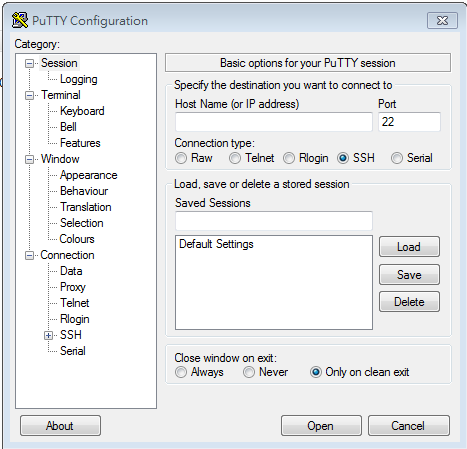

# 安全連線
### Windows:Putty


# 第一題解答
```
ssh連線進入140.110.112.27:2200
使用lab登入
指令:ls,cat
找到檔案flag
擷取內容

```
# 第二題解答
```
```
# 第一題解答
```
```
# 第一題解答
```
```
# 第一題解答
```
```
# 第一題解答
```
```
# 第一題解答
```
```
# 第一題解答
```
```
# 第一題解答
```
```
# 第一題解答
```
```
